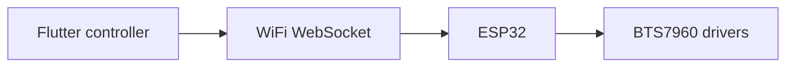

# Architecture

Staged Flutter and ESP32 RC car project with a WebSocket control protocol.

## Boundaries

Phase 1 implements local control. The camera/relay app and Internet/WebRTC signaling are later-phase scaffolds, not a completed remote FPV system.

## Layout

- `CHANGELOG.md`
- `README.md`
- `apps` — directory
- `docs` — directory
- `firmware` — directory
- `protocol` — directory
- `server` — directory
